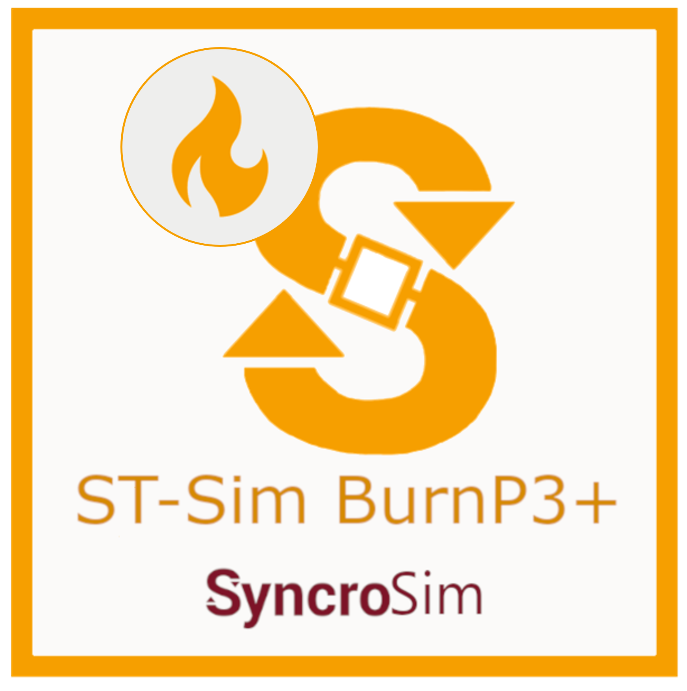
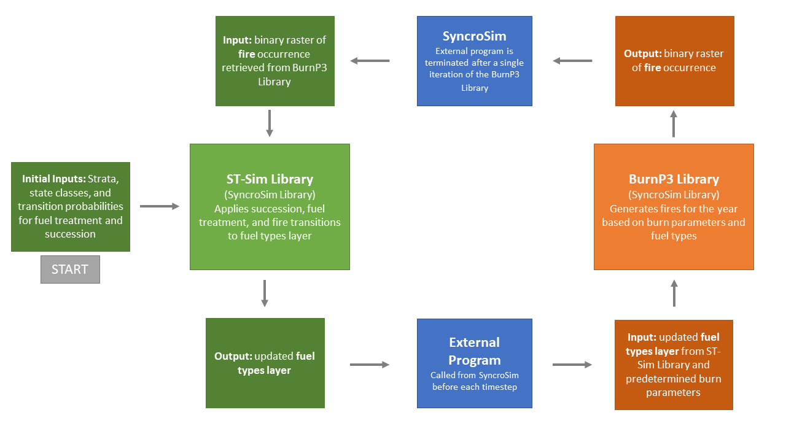

# **ST-Sim BurnP3+** SyncroSim Package

    <a href="https://github.com/ApexRMS/stsimBurnP3Plus">
 

## **ST-Sim BurnP3+** is an open-source <a href="https://syncrosim.com/" target="_blank">SyncroSim</a> add-on package incorporating fire simulation modelling to state and transition models (<a href="https://docs.stsim.net/getting_started/overview.html" target="_blank">**ST-Sim**</a>).

 

## Background

**ST-Sim BurnP3+** is an open-source <a href="https://syncrosim.com/" target="_blank">SyncroSim</a> add-on package to <a href="https://docs.stsim.net/getting_started/overview.html" target="_blank">**ST-Sim**</a> that integrates the SyncroSim fire modelling package <a href="https://burnp3.github.io/BurnP3Plus/" target="_blank">**BurnP3+**</a>. The _ST-Sim BurnP3+_ package allows users to design state-and-transition simulations (**ST-Sim**) that incorporate burn probability models (**BurnP3+**) at each timestep of the simulation. The package takes advantage of the _External Program_ functionality in the SyncroSim User Interface to essentially run two SyncroSim Libraries simultaneously. The below figure demonstrates the workflow of a multi-year simulation that models succession and fire using _ST-Sim BurnP3+_:

_
Green steps correspond to ST-Sim Library components, while orange steps correspond to BurnP3+ Library components. Blue boxes represent transitionary steps linking the ST-Sim and BurnP3+ Libraries.
_

 

## Requirements

This package requires SyncroSim <a href ="https://syncrosim.com/download/" target="_blank">version 2.4.18</a> or higher. The following packages are also required to use the **ST-Sim BurnP3+** package:

- <a href="https://github.com/BurnP3/BurnP3Plus" target="_blank">BurnP3+</a> and at least one fire growth add-on package (e.g. <a href="https://github.com/BurnP3/BurnP3PlusCell2Fire" target="_blank">BurnP3+Cell2Fire</a> or <a href="https://github.com/BurnP3/BurnP3PlusPrometheus" target="_blank">BurnP3+Prometheus</a>)
- <a href="https://github.com/ApexRMS/stsim" target="_blank">ST-Sim</a>

This package also requires (<a href ="https://cran.r-project.org/bin/windows/base/" target="_blank">R version 4.2.2</a> or higher. The following libraries are also required to use the **ST-Sim BurnP3+** package:

- <a href ="https://syncrosim.github.io/rsyncrosim/" target="_blank">rsyncrosim</a>
- <a href ="https://www.tidyverse.org/" target="_blank">tidyverse</a>
- <a href ="https://rspatial.org/index.html" target="_blank">terra</a>
- <a href ="https://fs.r-lib.org/" target="_blank">fs</a>

 

## Key Links

Browse source code at
<a href ="http://github.com/ApexRMS/stsimBurnP3Plus/" target="_blank">http://github.com/ApexRMS/stsimBurnP3Plus/</a>.  
Report a bug at
<a href ="http://github.com/ApexRMS/stsimBurnP3Plus/issues" target="_blank">http://github.com/ApexRMS/stsimBurnP3Plus/issues</a>.  

 

## Developers

Gabrielle Ednie (Author) 
 
Katie Birchard (Author, maintainer)
 
Leonardo Frid (Author) 
